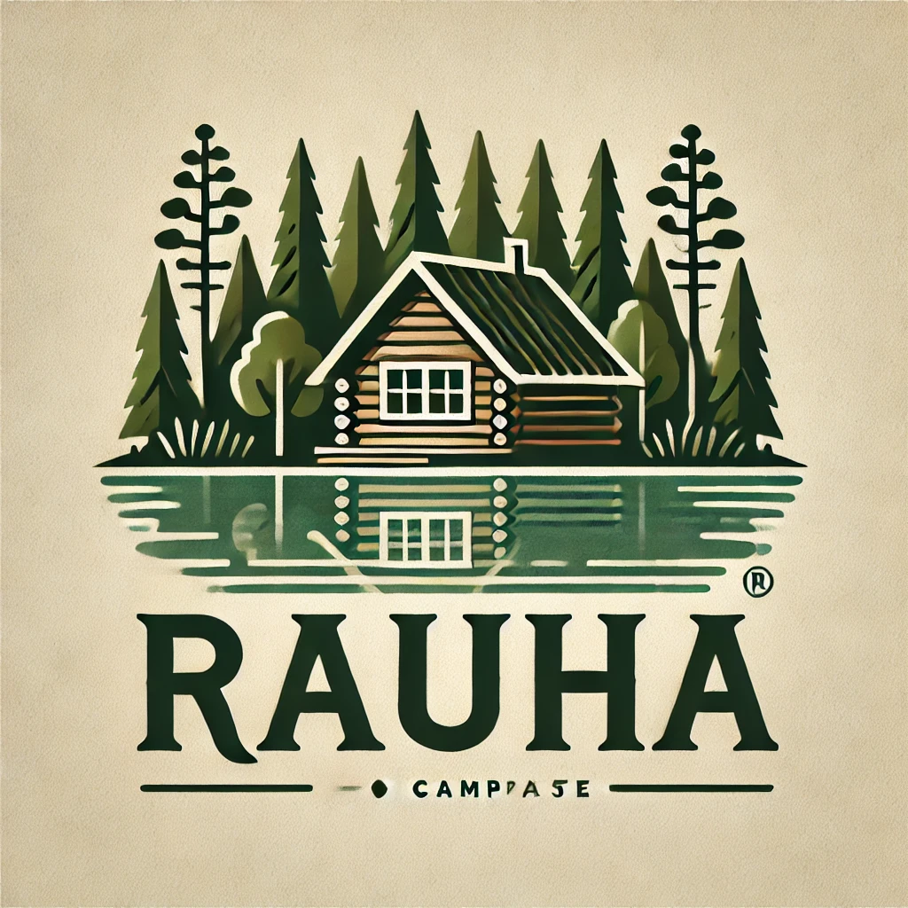
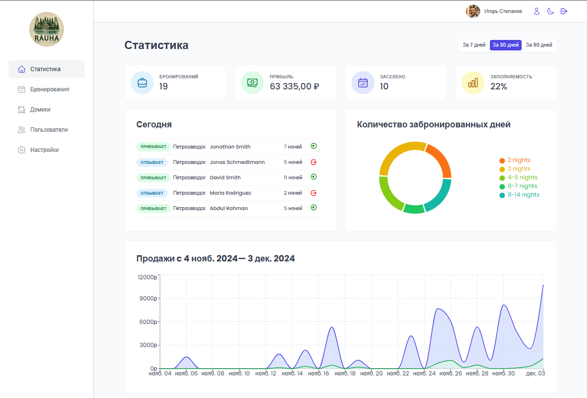

<div align="center">
  <div style="width: 90px; height: 90px; border-radius: 50%; overflow: hidden; margin: 0 auto;">
    
  </div>

  <h1>
    <a href="https://rauha-admin.netlify.app">
      Rauha - admin
    </a>
  </h1>

  <hr>
</div>

<!-- Badges -->
<div align="center">


</div>

<!-- Brief -->
<p align="center">
Welcome to <b>Rauha</b>! This is a hotel management web app, where hotel employees can manage cabins, bookings, and guests. It uses Supabase as the backend and implements advanced React techniques such as HOCs and React Query.
</p>

<!-- Screenshot -->
<a align="center" href="https://rauha-admin.netlify.app">



</a>

## Live Site

Check out the live admin app here: [Rauha - Admin](https://rauha-admin.netlify.app)

<!-- ## Customer Version

I also build a **customer version** of this app, where guests can view and book cabins, manage their bookings, and update their profiles. The repository is [here](https://github.com/stpkkk/rauha-admin), and the live site is [here](https://rauha-admin.netlify.app). -->

## Key Features

- User authentication ensures that only hotel employees can access the system.
- Employees can manage their profiles, including uploading avatars and changing passwords.
- The app features a dashboard showing recent stats on bookings, check-ins, and sales.
- Manage cabins with the ability to create, update, or delete cabin records.
- Handle bookings with the ability to check guests in and out, and update booking statuses.
- Real-time updates for cabins and bookings using Supabase.
- Visual statistics with charts displaying sales, occupancy rates, and other important data.
- Fully functional dark mode for a customized user experience.

## Technologies Used

- **React** for the frontend.
- **Supabase** for the database and real-time data updates.
- **React Query** for data fetching and caching.
- **React Router** for navigation.
- **React Hook Form** for efficient form handling.
- **Recharts** for data visualization (charts and stats).
- **Styled Components** for styling the UI, including dark mode.
- **Vite** for development environment and build system.

This project was a deep dive into several advanced React concepts, including:

- **Authentication and Authorization:** Implementing Supabase to securely manage user roles (hotel employees).
- **Real-time Functionality:** Leveraging Supabase's real-time features for dynamic data updates.
- **State Management and Data Fetching:** Using React Query to efficiently manage the app's data flow.
- **Complex UI Patterns:** Implementing reusable patterns like the Compound Component Pattern and Higher-Order Components (HOC) to create more maintainable and scalable code.
- **Dark Mode:** Adding dark mode functionality for a personalized user experience.
- **Data Visualization:** Using Recharts to create meaningful visual representations of hotel statistics.

## Setup Instructions

To run this project locally:

1. Clone the repo:
   ```bash
   git clone https://github.com/stpkkk/rauha-admin.git
   ```
2. Install dependencies:
   ```bash
   npm install
   ```
3. Set up environment variables:
   - Configure Supabase and add the necessary environment variables in a `.env` file. Check out the `.env.example` for reference.
4. Run the development server:
   ```bash
   npm run dev
   ```
5. Open [http://localhost:5173](http://localhost:5173) to see the app.

